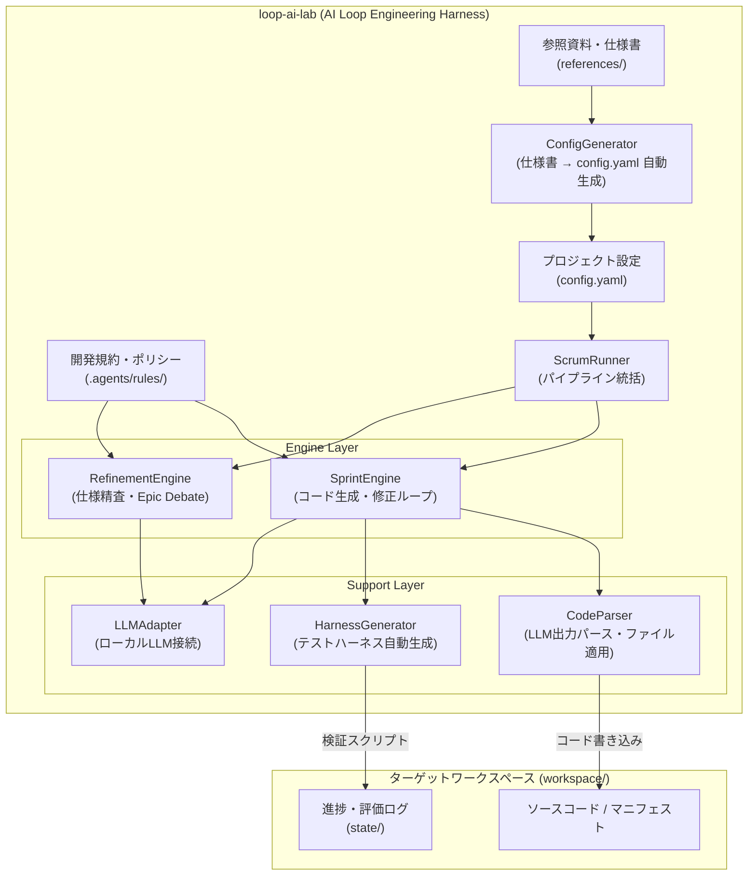

# loop-ai-lab (AI Loop Engineering Harness)

任意のリポジトリ（アプリケーション、Docker / Kubernetes / Helm マニフェスト、IaC、ドキュメント等）に対して、AI 自律開発・自動検証ループを安全かつ高速に回すための汎用評価・検証ハーネス環境です。

---

## 🏗 全体概念



---

## ⚡ クイックスタート

### 1. 仕様書を配置

`references/` ディレクトリにプロジェクトの仕様書（Markdown）を配置します：

```bash
cp your_project_spec.md references/
```

### 2. config.yaml を自動生成

仕様書からプロジェクト設定を自動生成します：

```bash
PYTHONPATH=. python3 runner/main.py init
```

これにより `config.yaml` に `project:` セクションが追加されます。生成された設定値を確認・必要に応じて修正してください。

### 3. パイプライン実行

```bash
# 全フェーズ実行（Refinement + Sprint）
PYTHONPATH=. python3 runner/main.py run --phase all

# Refinement（仕様精査・バックログ生成）のみ
PYTHONPATH=. python3 runner/main.py run --phase refinement

# Sprint（コード生成・テスト・修正ループ）のみ
PYTHONPATH=. python3 runner/main.py run --phase sprint --sprint 1
```

---

## ⚙️ 設定 (`config.yaml`)

`runner/main.py init` により自動生成されます。手動編集も可能です。

```yaml
DEV_PROVIDER: gemini
REFINEMENT_PROVIDER: gemini

project:
  name: avatar-service              # プロジェクト名
  workspace: workspace/avatar-service  # ワークスペースパス
  language: go                      # 主要言語
  module_name: avatar-service       # モジュール名 (go.mod module等)
  default_test_cmd: "go test ./..." # テストコマンド
  init_commands:                    # ワークスペース初期化コマンド
    - "go mod init avatar-service"
  project_file: go.mod              # プロジェクト定義ファイル
  format_cmd: "gofmt -w ."         # フォーマットコマンド
  lint_cmd: "go vet ./... || true" # リントコマンド
  file_extension: ".go"            # ソースファイル拡張子
  container_image_name: avatar-service  # コンテナイメージ名
  container_base: "gcr.io/distroless/static-debian12"
  run_user: nonroot                 # コンテナ実行ユーザー
  port: 8080                        # ポート番号
```

> **💡 他言語・他タスクの例**: Prometheusアラート設定の場合は `language: yaml`, `default_test_cmd: "promtool check rules alerts.yml"` のように設定します。

---

## 📁 ディレクトリ構成

```
loop-ai-lab/
├── config.yaml                 # プロジェクト設定（自動生成）
├── references/                 # 仕様書・参照資料（入力）
│   ├── icon_generator.md       # システム仕様書
│   └── go_clean_architecture.md
├── runner/                     # AI自律ランナー（Pythonパッケージ）
│   ├── main.py                 # CLI エントリーポイント (init / run)
│   ├── config/                 # 設定管理
│   │   ├── project_config.py   # ProjectConfig データクラス
│   │   └── config_generator.py # 仕様書→config.yaml 自動生成
│   ├── engine/                 # パイプラインエンジン
│   │   ├── scrum_runner.py     # ScrumRunner（統括クラス）
│   │   ├── refinement_engine.py # RefinementEngine（仕様精査）
│   │   └── sprint_engine.py    # SprintEngine（コード生成ループ）
│   ├── generators/             # ハーネス・スクリプト生成
│   │   └── harness_generator.py
│   ├── adapters/               # 外部LLM接続アダプター
│   │   └── llm_adapter.py
│   └── utils/                  # ユーティリティ
│       └── code_parser.py      # LLM出力パース・ファイル書き込み
├── .agents/rules/              # 開発規約・ポリシー
├── state/                      # 実行状態・評価ログ
│   ├── initiatives/            # Epic別バックログ・ハーネス
│   └── .evaluator/             # 評価結果・debate ログ
├── workspace/                  # ターゲットワークスペース（生成コード出力先）
└── scripts/                    # 補助スクリプト
```

---

## 🧩 アーキテクチャ

### クラス構成

| クラス | 責務 |
|---|---|
| `ScrumRunner` | パイプライン統括。RefinementEngine / SprintEngine を保持・実行 |
| `RefinementEngine` | 仕様精査、Per-Epic Multi-Persona Debate、バックログYAML生成 |
| `SprintEngine` | LLMによるコード生成、ハーネス実行、自動修正ループ |
| `HarnessGenerator` | Epic/Sprint別テストハーネススクリプト（.sh）の自動生成 |
| `CodeParser` | LLM出力から `# FILE:` ヘッダーブロックを解析、ファイルに適用 |
| `LLMAdapterFactory` | ローカルLLM（llama.cpp等）への接続アダプター |
| `ConfigGenerator` | `references/` の仕様書を解析して `config.yaml` を自動生成 |
| `ProjectConfig` | `config.yaml` から設定を読み込むデータクラス |

### 言語・プロジェクト非依存設計

全エンジン・ジェネレータは `ProjectConfig` 経由で設定値を参照し、Go/Python/Rust/YAML 等の言語固有コードをハードコードしません。新しいプロジェクトでは `references/` に仕様書を置いて `init` するだけで利用開始できます。

---

## 🐍 Python ハイブリッド LLM ランナー

`runner/main.py` を使用して、評価・監査とコード実装を組み合わせた自律ループを実行します。

### LLM 設定

ローカルLLMサーバー（llama.cpp / Ollama互換）への接続URLは環境変数で設定：

```bash
export LOCAL_LLM_URL="http://127.0.0.1:11435"
```

### 実行方法

```bash
# 依存ライブラリのインストール
pip install pyyaml requests

# config.yaml 自動生成
PYTHONPATH=. python3 runner/main.py init

# パイプライン実行
PYTHONPATH=. python3 runner/main.py run --phase all
```
