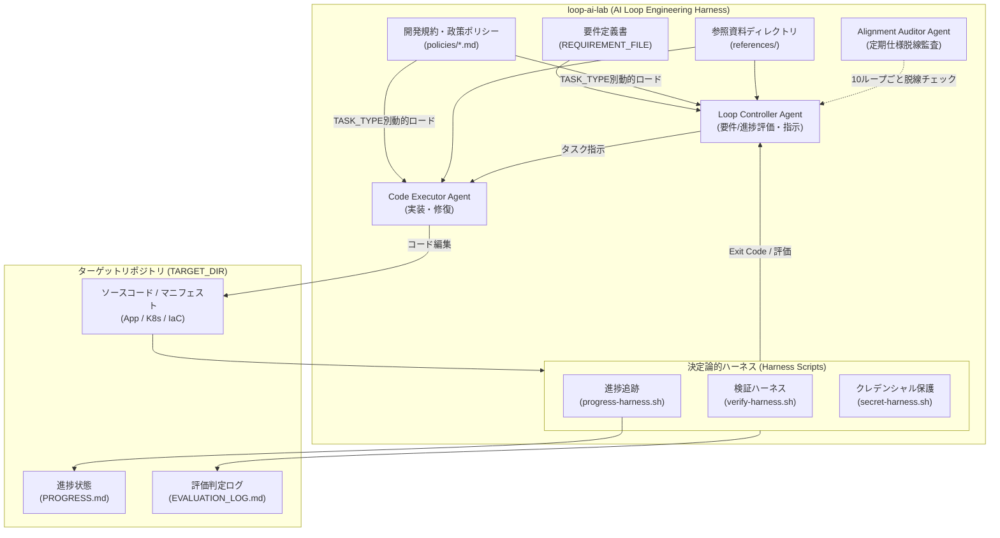

# loop-ai-lab (AI Loop Engineering Harness)

任意のリポジトリ（アプリケーション、Docker / Kubernetes / Helm マニフェスト、IaC、ドキュメント等）に対して、AI 自律開発・自動検証ループを安全かつ高速に回すための汎用評価・検証ハーネス環境です。

---

## 🏗 全体概念



---

## ⚡ 進捗管理・評価ログ・方向性監査 (Alignment Audit)

- **進捗追跡 (`PROGRESS.md`)**: タスクをフェーズごとにチェックリスト形式で視覚化・管理。成功したタスクは決定論的に `[x]` 更新。
- **判断ブレ蓄積ログ (`EVALUATION_LOG.md`)**: 毎ステップの評価結果と指示をログに蓄積。Evaluator は直近の判断履歴 (`HISTORY_CONTEXT_COUNT=3`) をコンテキストに注入して評価を行うため、前言撤回や評価軸のブレを防止。
- **定期方向性監査 (`REVIEW_INTERVAL=10`)**: 10ループごとに `agents/alignment-auditor.md` が起動し、「仕様書からの脱線」「不要な過剰実装」「目的のすり替わり」がないかを自動監査。

---

## ⚙️ 使い方

### 1. 設定 (`config.env`)

`config.env` にターゲットとなるローカルリポジトリのパスおよび検証コマンドを設定します：

```bash
# 対象リポジトリのパス
TARGET_DIR="/path/to/your-target-repo"

# 達成すべき要件・仕様書
REQUIREMENT_FILE="./requirements.sample.md"

# ターゲットリポジトリ側で合否判定（Green/Red）に使用するコマンド
# 例: "go test ./...", "helm template .", "docker compose config", "make test"
VERIFY_COMMAND="make test"

# SOPS クレデンシャル保護チェック (true / false)
ENABLE_SOPS=false
```

### 2. クレデンシャル安全チェックの実行

```bash
./scripts/secret-harness.sh
```

## 🐍 Python ハイブリッド LLM ランナー (マルチ LLM アダプター)

`runner/run_loop.py` を使用して、評価・監査（Gemini API）とコード実装（ローカル LLM）を組み合わせた自律ループを実行します。

### アダプター設定 (`config.env`)

`config.env` で用途ごとにプロバイダー (`gemini`, `local_ollama`, `openai`) やモデル名を切り替え可能です：

```bash
# 評価・指示・監査担当 (Evaluator / Auditor)
EVALUATOR_PROVIDER="gemini"
EVALUATOR_MODEL="gemini-2.5-flash"

# 実装・コード書き換え担当 (Executor)
EXECUTOR_PROVIDER="local_ollama"
EXECUTOR_MODEL="deepseek-coder"
LOCAL_LLM_URL="http://localhost:11434/v1"
```

### 実行方法

```bash
# 依存ライブラリのインストール
pip install -r runner/requirements.txt

# ランナーの起動
python3 runner/run_loop.py
```

---

## 📁 ディレクトリ構成

- `config.env`: 対象リポジトリや検証コマンドを設定するメイン設定ファイル
- `requirements.sample.md`: AI に渡す要件仕様書のサンプル
- `scripts/`:
  - `verify-harness.sh`: ターゲット側での検証コマンド実行と合否判定
  - `secret-harness.sh`: `.gitignore` や SOPS によるクレデンシャル保護チェック
- `agents/`:
  - `loop-controller.md`: ループ全体を評価・指示する Agent のプロンプト定義
  - `code-executor.md`: 具現化実装・修正を担当する Agent のプロンプト定義
- `workspace/`: 初回動作テスト用サンプルプロジェクト
