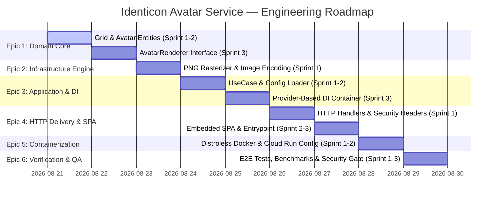

# Initiative Overview & Engineering Roadmap

## 1. Executive Summary & Initiative Scope

### 1.1 Executive Summary
The **Identicon Avatar Generation Microservice (`avatar-service`)** is an enterprise-grade, deterministic, geometric avatar generation engine implemented in **Go**. The service transforms arbitrary seed strings (e.g., usernames, emails, UUIDs) into unique, horizontally symmetric 5×5 pixel-art identicons delivered as 250×250 PNG images via a high-performance REST API and an interactive embedded Single Page Application (SPA) frontend.

The service is engineered according to strict **Go Clean Architecture** and Domain-Driven Design (DDD) principles:
- **Zero External Dependencies:** Built exclusively on the Go standard library (`image`, `image/color`, `image/png`, `image/draw`, `crypto/md5`, `net/http`, `embed`).
- **Strict Inward Dependency Flow:** Infrastructure $\rightarrow$ Application $\rightarrow$ Domain.
- **Provider-Based Dependency Injection:** Modular wiring in `internal/di` utilizing interface-returning constructors.
- **Cloud-Native & Serverless Ready:** Designed for Google Cloud Run with minimal memory footprint (<128MiB), sub-second cold starts, 100% stateless execution, and a non-root Distroless container image.

---

## 2. Architectural Principles & Coding Standards

### 2.1 Clean Architecture Directory Structure
```
avatar-service/
├── cmd/
│   └── server/
│       └── main.go                  # Application entry point, DI resolution & server lifecycle
├── internal/
│   ├── di/
│   │   ├── di.go                    # Dependency Injection container & provider wiring
│   │   └── di_test.go               # DI container verification tests
│   ├── domain/
│   │   ├── model/
│   │   │   ├── avatar.go            # Avatar domain entity (NewAvatar)
│   │   │   ├── avatar_test.go       # Avatar entity unit tests
│   │   │   ├── grid.go              # 5x5 Grid matrix entity (NewGrid)
│   │   │   └── grid_test.go         # Grid parity and symmetry tests
│   │   └── repository/
│   │       └── avatar_renderer.go   # Domain repository/port interface (AvatarRenderer)
│   ├── application/
│   │   └── usecase/
│   │       ├── avatar_usecase.go    # UseCase: Orchestrates Avatar generation & rendering
│   │       └── avatar_usecase_test.go # UseCase unit tests
│   └── infrastructure/
│       ├── config/
│       │   ├── config.go            # Environment variable loader (PORT, APP_*)
│       │   └── config_test.go       # Configuration unit tests
│       ├── handler/
│       │   ├── avatar_handler.go    # HTTP REST & SPA Handlers (GET /api/avatar, GET /)
│       │   └── avatar_handler_test.go # HTTP Handler integration tests
│       └── renderer/
│           ├── png_renderer.go      # PNG rasterizer implementing repository.AvatarRenderer
│           └── png_renderer_test.go # PNG rendering & dimension tests
├── static/
│   └── index.html                   # Single Page Application (Embedded via Go embed)
├── build/
│   └── package/
│       └── Dockerfile               # Multi-stage Distroless build
├── test/
│   └── e2e/
│       └── e2e_test.go              # End-to-end integration & edge case test suite
├── .dockerignore                    # Docker build ignore rules
├── go.mod                           # Go module definition (zero external dependencies)
├── prompt_history.md                # Project execution & decision log
└── README.md                        # Project documentation & Cloud Run deployment guide
```

### 2.2 Core Design Rules & Constraints
1. **Dependency Inversion:** The Domain layer contains zero references to HTTP, PNG encoding, or configuration. External adapters implement domain interfaces (`repository.AvatarRenderer`).
2. **Package Collision Prevention:** Strictly utilize Go's standard `image/color` package (`color.RGBA`). Never create custom packages or files named `color` (e.g., `domain/color`).
3. **Exported Symbol Integrity:** Domain constructors (`NewGrid`, `NewAvatar`) and public interfaces must retain stable signatures across refactorings.
4. **Cloud-Native Logging Standards:**
   - Standard output (`stdout`): Restricted to lifecycle state transitions (startup, shutdown) and single-line summary statistics.
   - Standard error (`stderr`): Reserved for failure events with complete error context.
   - No high-frequency per-request success logs inside loops.
5. **Environment Configuration:** Support standard `PORT` (fallback `8080`) and scoped application variables under the `APP_` namespace.

---

## 3. Algorithmic & Mathematical Specifications

### 3.1 Identicon Generation Algorithm
```text
[ Seed String (e.g., "alice@example.com") ]
       │
       ▼ MD5 Hash Calculation (16-byte array: hash[0..15])
 ┌──────────────────────────────────────────────────────────────┐
 │ Byte 0..2  : Main Color RGB (R=hash[0], G=hash[1], B=hash[2])  │
 │ Byte 3..15 : 5×5 Grid Fill Decision (Even = Fill, Odd = Blank) │
 └──────────────────────────────────────────────────────────────┘
       │
       ▼ 5×5 Matrix Mapping (Horizontal Symmetric Mirroring)
 ┌───────────────┬───────────────┬───────────────┬───────────────┬───────────────┐
 │ Column 0 (B3) │ Column 1 (B4) │ Column 2 (B5) │ Column 3 (B4) │ Column 4 (B3) │ (Row 0)
 │ Column 0 (B6) │ Column 1 (B7) │ Column 2 (B8) │ Column 3 (B7) │ Column 4 (B6) │ (Row 1)
 │ Column 0 (B9) │ Column 1 (B10)│ Column 2 (B11)│ Column 3 (B10)│ Column 4 (B9) │ (Row 2)
 │ Column 0 (B12)│ Column 1 (B13)│ Column 2 (B14)│ Column 3 (B13)│ Column 4 (B12)│ (Row 3)
 │ Column 0 (B15)│ Column 1 (B0) │ Column 2 (B1) │ Column 3 (B0) │ Column 4 (B15)│ (Row 4)
 └───────────────┴───────────────┴───────────────┴───────────────┴───────────────┘
       │
       ▼ Rasterization (50px × 50px per cell + Background #F0F2F5)
 [ 250px × 250px PNG Stream via image/png ]
```

### 3.2 Key Parameters
- **Dimensions:** 250px × 250px (5 × 5 grid of 50px × 50px blocks).
- **Foreground Color:** Derived from `color.RGBA{R: hash[0], G: hash[1], B: hash[2], A: 255}`.
- **Background Color:** Fixed light gray `color.RGBA{R: 240, G: 242, B: 245, A: 255}` (`#F0F2F5`).
- **Parity Fill Rule:** `byte % 2 == 0` evaluates to filled (`true`); `byte % 2 != 0` evaluates to blank (`false`).
- **Symmetry Rule:** `grid[row][3] = grid[row][1]` and `grid[row][4] = grid[row][0]`.

---

## 4. Engineering Epic Phases Breakdown



---

### Epic 1: Domain Core & Algorithmic Modeling
**Objective:** Construct pure domain models, deterministic parity/symmetry algorithms, and repository port interfaces with zero third-party dependencies and 100% unit test coverage.

- **Sprint 1: 5×5 Symmetric Grid Matrix Entity**
  - **Target Files:** `internal/domain/model/grid.go`, `internal/domain/model/grid_test.go`
  - **Deliverables:**
    - `Grid` struct representing a 5×5 boolean matrix (`[5][5]bool`).
    - `NewGrid(hash [16]byte) *Grid` constructor implementing byte parity fill and horizontal symmetry mirroring (`Col 3 = Col 1`, `Col 4 = Col 0`).
  - **Verification:** Unit tests verifying parity calculation, 5×5 symmetry guarantees, and deterministic output across test vectors.

- **Sprint 2: Avatar Entity & Color Derivation**
  - **Target Files:** `internal/domain/model/avatar.go`, `internal/domain/model/avatar_test.go`
  - **Deliverables:**
    - `Avatar` struct encapsulating seed, MD5 hash (`[16]byte`), foreground color (`color.RGBA`), background color (`color.RGBA`), and `Grid`.
    - `NewAvatar(seed string) *Avatar` constructor with MD5 generation and standard `image/color` usage.
  - **Verification:** Unit tests verifying MD5 derivation, color channel mapping, and default seed handling.

- **Sprint 3: AvatarRenderer Port Interface**
  - **Target Files:** `internal/domain/repository/avatar_renderer.go`
  - **Deliverables:**
    - `AvatarRenderer` interface definition: `Render(avatar *model.Avatar) ([]byte, error)`.
  - **Verification:** Interface compilation and boundary verification (no infrastructure imports).

---

### Epic 2: Infrastructure Adapters — PNG Rendering Engine
**Objective:** Implement the concrete image rasterization adapter that converts domain `Avatar` entities into compliant 250×250 PNG binaries.

- **Sprint 1: PNG Rasterization & Stream Encoding**
  - **Target Files:** `internal/infrastructure/renderer/png_renderer.go`, `internal/infrastructure/renderer/png_renderer_test.go`
  - **Deliverables:**
    - `PNGRenderer` struct satisfying `repository.AvatarRenderer`.
    - `NewPNGRenderer() repository.AvatarRenderer` provider constructor.
    - 250×250 `image.RGBA` canvas initialization, 50×50 pixel block painting via `image/draw`, and standard `image/png` encoding.
  - **Verification:** Test verifying valid PNG magic bytes (`\x89PNG\r\n\x1a\n`), decoded dimensions (250×250), and sub-millisecond execution.

---

### Epic 3: Application UseCase & Dependency Injection
**Objective:** Implement use-case orchestration, environment configuration parsing, and provider-based DI container wiring.

- **Sprint 1: Avatar Generation UseCase**
  - **Target Files:** `internal/application/usecase/avatar_usecase.go`, `internal/application/usecase/avatar_usecase_test.go`
  - **Deliverables:**
    - `AvatarUseCase` interface and `avatarUseCase` implementation.
    - `NewAvatarUseCase(renderer repository.AvatarRenderer) AvatarUseCase` provider.
    - Orchestration of `model.NewAvatar` and `renderer.Render`.
  - **Verification:** Unit tests with mock/real renderers confirming proper error handling and seed propagation.

- **Sprint 2: Scoped Environment Configuration Loader**
  - **Target Files:** `internal/infrastructure/config/config.go`, `internal/infrastructure/config/config_test.go`
  - **Deliverables:**
    - `Config` struct supporting `PORT` (fallback `8080`) and `APP_` namespace variables.
    - `LoadConfig() (*Config, error)` provider.
  - **Verification:** Unit tests for default fallbacks and custom environment variable overrides.

- **Sprint 3: Provider-Based DI Container**
  - **Target Files:** `internal/di/di.go`, `internal/di/di_test.go`
  - **Deliverables:**
    - `Container` struct holding resolved dependencies (`Config`, `AvatarUseCase`, `AvatarHandler`).
    - `NewContainer(staticFS embed.FS) (*Container, error)` wiring providers cleanly without monolithic factory bloat.
  - **Verification:** Unit tests validating proper dependency resolution and error propagation.

---

### Epic 4: HTTP Interface, Handlers & Embedded SPA Frontend
**Objective:** Build REST API endpoints, embedded SPA presentation layer, security header middleware, and graceful server lifecycle management.

- **Sprint 1: HTTP Handlers & Security Headers**
  - **Target Files:** `internal/infrastructure/handler/avatar_handler.go`, `internal/infrastructure/handler/avatar_handler_test.go`
  - **Deliverables:**
    - `AvatarHandler` with `HandleGetAvatar` (`GET /api/avatar?seed=`) and `HandleIndex` (`GET /`).
    - Seed validation (<= 256 characters) and defaulting to `"default"`.
    - HTTP headers: `Content-Type: image/png`, `Cache-Control: public, max-age=86400`, `X-Content-Type-Options: nosniff`, `X-Frame-Options: DENY`, and strict Content Security Policy (CSP).
  - **Verification:** `httptest` suite verifying status codes, headers, and payload integrity.

- **Sprint 2: Interactive Embedded SPA Frontend**
  - **Target Files:** `static/index.html`
  - **Deliverables:**
    - Clean, modern UI using Tailwind CSS (CDN).
    - Real-time debounced preview input, random seed generator button, and PNG download button.
    - XSS-safe DOM manipulation (strictly using `textContent`, `setAttribute`, zero `innerHTML`).
  - **Verification:** Browser/DOM inspection and static security check.

- **Sprint 3: Application Entrypoint & Graceful Lifecycle**
  - **Target Files:** `cmd/server/main.go`
  - **Deliverables:**
    - `//go:embed static/*` binary asset packaging.
    - `http.Server` configuration with read/write/idle timeouts.
    - Cloud-native lifecycle logging (`stdout`) and OS signal handling (`SIGINT`, `SIGTERM`) for zero-downtime draining.
  - **Verification:** Server startup, signal termination, and asset embedding tests.

---

### Epic 5: Containerization & Cloud Run Deployment Configuration
**Objective:** Package the service into an ultra-secure, minimal Distroless container image and document production deployment configurations.

- **Sprint 1: Distroless Multi-Stage Dockerfile**
  - **Target Files:** `build/package/Dockerfile`, `.dockerignore`
  - **Deliverables:**
    - Multi-stage Dockerfile: `golang:1.22-alpine` builder (`CGO_ENABLED=0`, `-ldflags="-s -w"`) $\rightarrow$ `gcr.io/distroless/static-debian12:nonroot`.
    - Non-root user execution under UID/GID `65532`.
  - **Verification:** Docker build verification, binary size check (<25MB), and non-root execution audit.

- **Sprint 2: Deployment Specifications & Documentation**
  - **Target Files:** `README.md`
  - **Deliverables:**
    - Documentation for local execution, Docker build/run, API documentation, and `gcloud run deploy` command specifications (128MiB RAM, 0.5 vCPU, min 0, max 5).
  - **Verification:** Documentation completeness and Markdown compliance.

---

### Epic 6: End-to-End Verification, Performance Benchmark & Quality Gate
**Objective:** Conduct comprehensive E2E testing, race condition auditing, performance benchmarking, and security compliance verification.

- **Sprint 1: End-to-End Integration & Edge Case Test Suite**
  - **Target Files:** `test/e2e/e2e_test.go`
  - **Deliverables:**
    - Comprehensive HTTP integration test suite covering ASCII, multibyte UTF-8 (Japanese, Kanji, Emoji), empty seeds, whitespace seeds, and oversized seed rejection (400 Bad Request).
  - **Verification:** 100% test pass rate across all edge cases.

- **Sprint 2: Performance Benchmarking & Zero-Allocation Profiling**
  - **Target Files:** `internal/infrastructure/renderer/png_renderer_bench_test.go`, `internal/application/usecase/avatar_usecase_bench_test.go`
  - **Deliverables:**
    - Go benchmark suite measuring rendering throughput and memory allocations.
    - Concurrency and race detection testing (`go test -race ./...`).
  - **Verification:** Sub-millisecond rendering per avatar (<1ms/op) and 0 data races.

- **Sprint 3: Security Compliance & Quality Gate Sign-Off**
  - **Target Files:** `state/initiatives/quality_gate_report.md`
  - **Deliverables:**
    - Security audit report validating OWASP Top 10 defenses, DOM XSS immunity, least privilege compliance, and cloud logging rules.
  - **Verification:** Zero critical/high vulnerabilities; full quality gate sign-off.

---

## 5. Traceability Matrix

| Requirement / Constraint | Source Authority | Implementing Epic & Sprint | Target Artifact / File | Validation Method |
| :--- | :--- | :--- | :--- | :--- |
| **Clean Architecture Layout** | `GEMINI.md`, `go_clean_architecture.md` | Epic 1, 2, 3, 4 | `internal/`, `cmd/` | Layer boundary & dependency direction audit |
| **Standard `image/color` Usage** | `go_clean_architecture.md` | Epic 1 (Sprint 2) | `internal/domain/model/avatar.go` | Static import check (no custom color package) |
| **Constructor Symbol Integrity** | `go_clean_architecture.md` | Epic 1 (Sprint 1, 2) | `grid.go`, `avatar.go` | Exported symbol & constructor signature audit |
| **5×5 Symmetric MD5 Algorithm** | `icon_generator.md` | Epic 1 (Sprint 1) | `internal/domain/model/grid.go` | Unit tests for horizontal symmetry & parity |
| **250×250 PNG Output (50px cells)** | `icon_generator.md` | Epic 2 (Sprint 1) | `png_renderer.go` | Decoded PNG dimensions & magic byte validation |
| **Provider-Based DI Container** | `GEMINI.md` | Epic 3 (Sprint 3) | `internal/di/di.go` | Container resolution & provider unit tests |
| **Config & PORT Fallback (8080)** | `GEMINI.md`, `icon_generator.md` | Epic 3 (Sprint 2) | `internal/infrastructure/config/` | Environment override & default fallback tests |
| **HTTP Handlers & Security Headers** | `icon_generator.md`, `GEMINI.md` | Epic 4 (Sprint 1) | `internal/infrastructure/handler/` | HTTP integration tests (`httptest`) |
| **Embedded Single Page App** | `icon_generator.md` | Epic 4 (Sprint 2, 3) | `static/index.html`, `main.go` | `//go:embed` compilation & browser testing |
| **Distroless Non-Root Container** | `icon_generator.md` | Epic 5 (Sprint 1) | `build/package/Dockerfile` | Docker image inspect (UID 65532, size < 25MB) |
| **Cloud Run Serverless Specs** | `icon_generator.md` | Epic 5 (Sprint 2) | `README.md` | Configuration & deployment command audit |
| **E2E & Performance Gates** | `icon_generator.md`, `GEMINI.md` | Epic 6 (Sprint 1, 2, 3) | `test/e2e/`, `*_bench_test.go` | E2E suite, race detector, benchmark (<1ms) |

---

## 6. Execution Workflow & Next Steps

1. **Initiative Alignment:** Confirm the breakdown of Epics 1 through 6 against user and project specifications.
2. **Phase Execution:** Proceed sequentially through the Epics according to the established sprint backlogs and quality gates.
